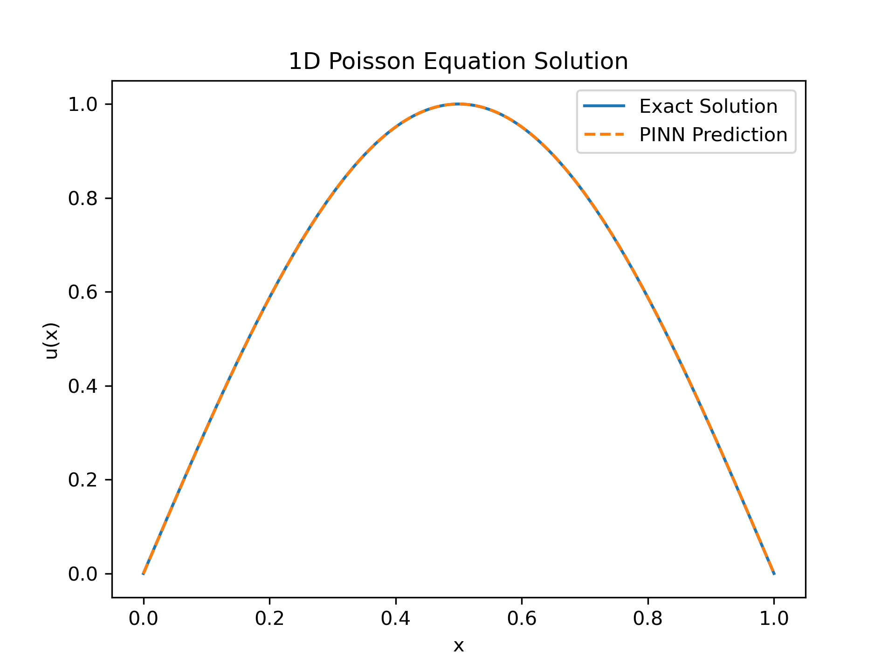

# Physics-Informed Neural Network for the 1D Poisson Equation

This repository implements a **Physics-Informed Neural Network (PINN)** to solve the
one-dimensional Poisson equation, serving as a foundational study of PINN-based
methods for partial differential equations (PDEs).

The implementation follows the conceptual framework introduced by
Raissi et al. (2019), with emphasis on understanding **physics-constrained learning,
automatic differentiation, and numerical stability**.

---

## Problem Statement

We consider the one-dimensional Poisson equation:

\[
\frac{d^2 u(x)}{dx^2} = \pi^2 \sin(\pi x), \quad x \in (0, 1)
\]

subject to homogeneous Dirichlet boundary conditions:

\[
u(0) = 0, \quad u(1) = 0
\]

The analytical solution is:

\[
u(x) = \sin(\pi x)
\]

---

## Methodology

A fully-connected neural network is used to approximate the solution \( u(x) \).
The network is trained by minimizing a composite loss function consisting of:

- **PDE residual loss**, enforcing the governing equation
- **Boundary condition loss**, enforcing physical constraints at the domain boundaries

Spatial derivatives are computed using **automatic differentiation**, ensuring exact
gradient evaluation without numerical discretization.
No labeled solution data are used during training.

---

## Results and Validation

The trained PINN accurately reproduces the analytical solution across the domain.
Validation is performed by direct comparison between the PINN prediction and the
closed-form solution, demonstrating correct physical behavior and numerical consistency.

---

## Purpose and Scope

This project serves as a **baseline implementation** to develop intuition for
physics-informed learning before extending the framework to:

- Nonlinear and time-dependent PDEs  
- Shock-dominated and convection-driven flows  
- Physics-informed modeling of hypersonic flow phenomena  

The focus is on **methodological understanding** rather than performance optimization.

---

## Reference

Raissi, M., Perdikaris, P., & Karniadakis, G. E. (2019).  
*Physics-informed neural networks: A deep learning framework for solving forward and
inverse problems involving nonlinear partial differential equations.*  
Journal of Computational Physics, **378**, 686–707.

